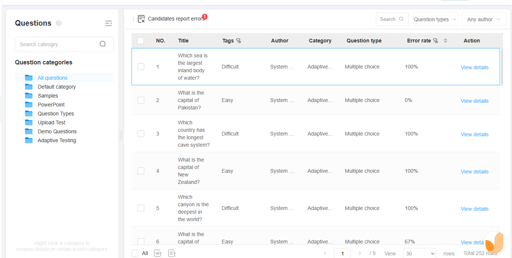

# ExamTwist - Admin Platform

questions management demo: 

This is the admin platform for ExamTwist, an exam management system. It is a single-page application built with React, TypeScript, and Vite.

## Table of Contents

- [Technology Stack](#technology-stack)
- [Project Structure](#project-structure)
- [Getting Started](#getting-started)
  - [Prerequisites](#prerequisites)
  - [Installation](#installation)
  - [Development](#development)
  - [Building for Production](#building-for-production)
- [Available Scripts](#available-scripts)
- [Deployment](#deployment)

## Technology Stack

- **React 19**: A JavaScript library for building user interfaces.
- **TypeScript**: A typed superset of JavaScript that compiles to plain JavaScript.
- **Vite**: A fast build tool and development server.
- **React Router**: For declarative routing in the application.
- **Redux Toolkit**: For state management.
- **Tailwind CSS**: A utility-first CSS framework for styling.
- **radix-ui**: A collection of re-usable components.
- **ApexCharts**: For creating interactive charts.
- **React Hook Form**: For building forms.
- **ESLint**: For code linting.
- **Prettier**: For code formatting.

## Project Structure

```
src/
├── assets/           # Static assets (images, icons, svgs)
├── components/       # Reusable UI components
├── hooks/            # Custom React hooks
├── layouts/          # Page layouts and templates
├── lib/              # Utility functions and libraries
├── pages/            # Page components
├── providers/        # React context providers
├── redux/            # Redux store, slices, and API endpoints
├── routes/           # Application routing configuration
├── theme/            # Theme configuration and constants
├── types/            # TypeScript type definitions
└── utils/            # Helper functions
```

## Getting Started

### Prerequisites

- Node.js (version 16 or higher)
- npm, yarn, pnpm, or bun package manager

### Installation

1. Clone the repository:

   ```bash
   git clone <repository-url>
   cd ExamTwist-admin
   ```

2. Install dependencies:
   ```bash
   npm install
   ```

### Development

Start the development server with hot reloading:

```bash
npm run dev
```

The application will be available at `http://localhost:5173` by default.

### Building for Production

Create a production build:

```bash
npm run build
```

Preview the production build locally:

```bash
npm run preview
```

## Available Scripts

- `dev`: Starts the development server.
- `build`: Creates a production build.
- `preview`: Previews the production build locally.
- `lint`: Runs ESLint on the codebase.

## Deployment

The application can be deployed to any static hosting service. The `vercel.json` file in the repository is configured for deployment on Vercel.

---

Built with ❤️ using React, TypeScript, and Vite
